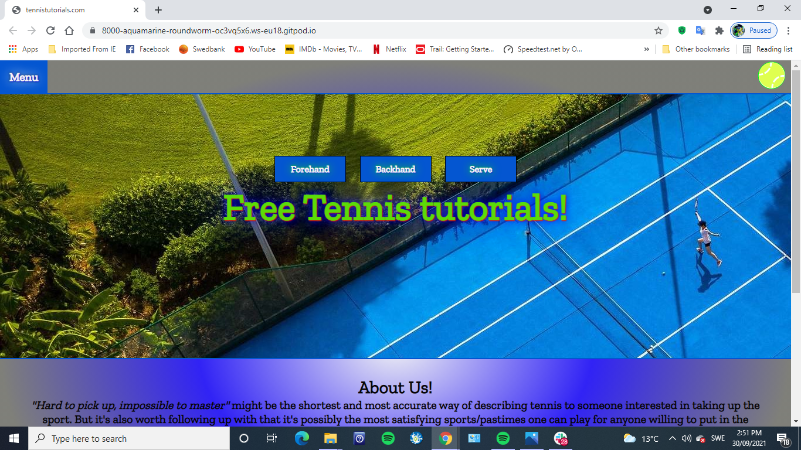
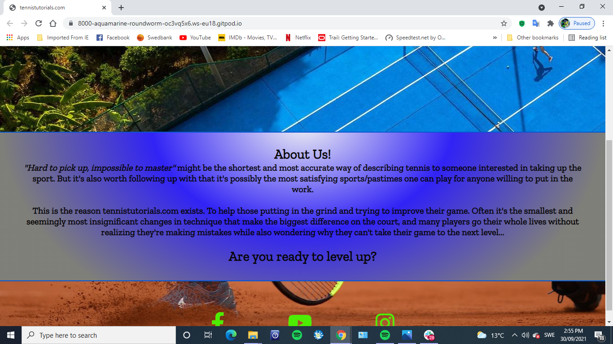
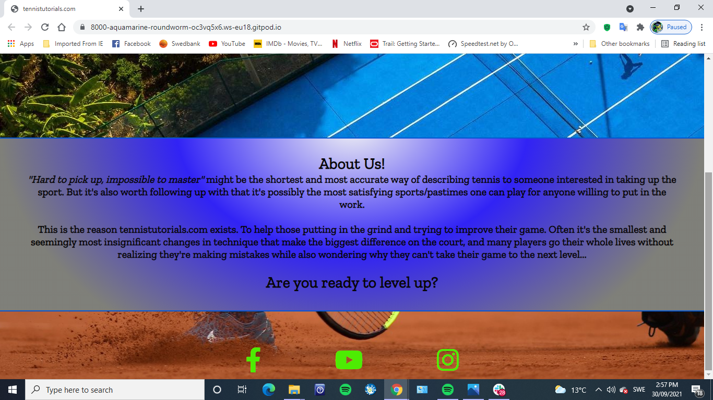
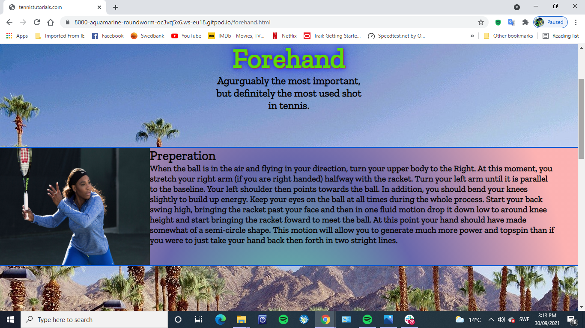
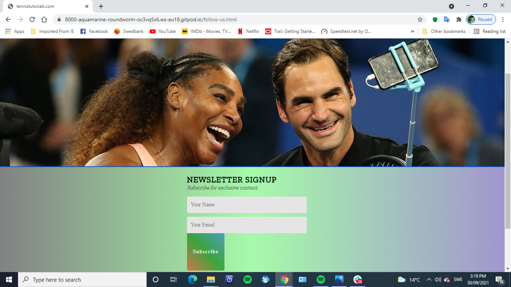

# Tennis Tutorials

Tennis Tutorials is a website to help those passionate about tennis. There are few sports in which the players scrutinise themselves as much as tennis players do, they may if fact only matched by golfers. This website is a resource, particularly for newcomers, to help sort out some kinks in their technique sooner rather than later.  

## Features 

At launch, the website will offer tutorials on only the three most used strokes in tennis (forehand, backhand, serve). Leaving room for expansion, drawing return visitors and social media/newsletter subscribers.

### Existing Features

- __Navigation Bar__

  - All pages feature a drop down menu that gives access to all the pages quickly and easily as well as a logo that direct the user home. On top of that the home, forehand, backhand and serve pages all have animated buttons close to the centre of the screen to encourage users to view more. 

- __The landing page image__

  - The landing includes a photograph with text overlay to allow the user to see exactly which location this site would be applicable to. 
  - This section introduces the user to Tennis Tutorials with an eye catching image to grab their attention

- __About Section__

  - This section will describe the purpose of Tennis Tutorials and also motivate and encourage those wanting to learn.

- __The Footer__ 

  - The footer section includes links to the relevant social media sites for Tennis Tutorials. The links will open to a new tab to allow easy navigation for the user. 
  - The footer is valuable to the user as it encourages them to keep connected via social media

__The tutorial pages__

 -  Pages 2, 3 & 4 consist of step by step instructions on how to perform the tennis stroke respective to that page. Each one is laid out in a three step manner with images showing what should be done.

 

- __The Sign Up Page__

  - The sign up page will give users a chance to subscribe to a newsletter and be given access to exclusive content and tutorials. The user will be asked to submit their full name and email address. 

### Features Left to Implement

- A feature for the future will be imbedded video lessons.

## Testing 

The website has been tested thoroughly and performs in a snappy and responsive manner.Chrome developer tools were used to make sure all scaling issues were found and fixed. The website is vibrant and responsive on both mobile and desktop devices. 

## Deployment

This section should describe the process you went through to deploy the project to a hosting platform (e.g. GitHub) 

- The site was deployed to GitHub pages. The steps to deploy are as follows: 
  - In the GitHub repository, navigate to the Settings tab 
  - From the source section drop-down menu, select the Master Branch
  - Once the master branch has been selected, the page will be automatically refreshed with a detailed ribbon display to indicate the successful deployment. 

The live link can be found here - https://github.com/CharlottesHead/P1-tennistutorials

## Credits 

### Content 

- The icons in the footer were taken from [Font Awesome](https://fontawesome.com/)

### Media

- The images were taken from pintrest.